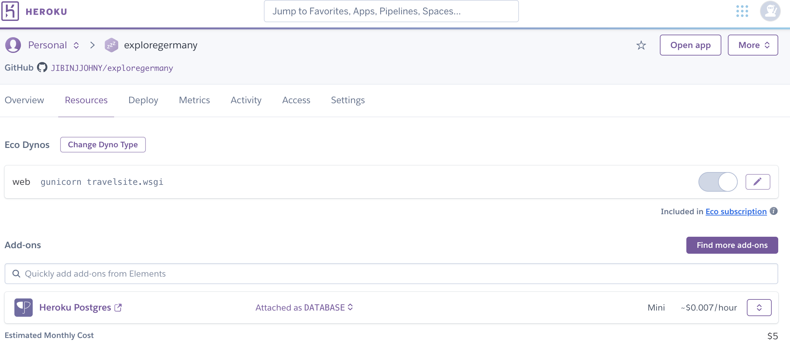
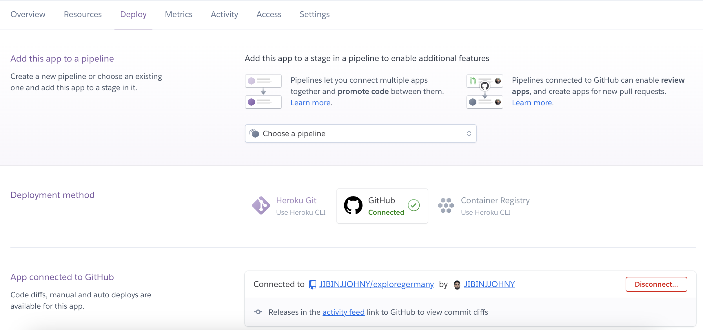
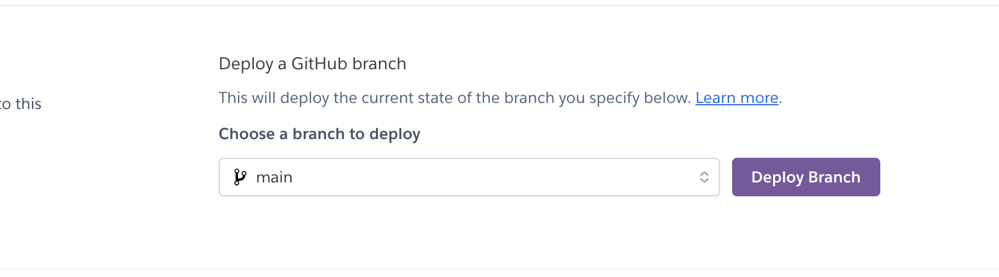
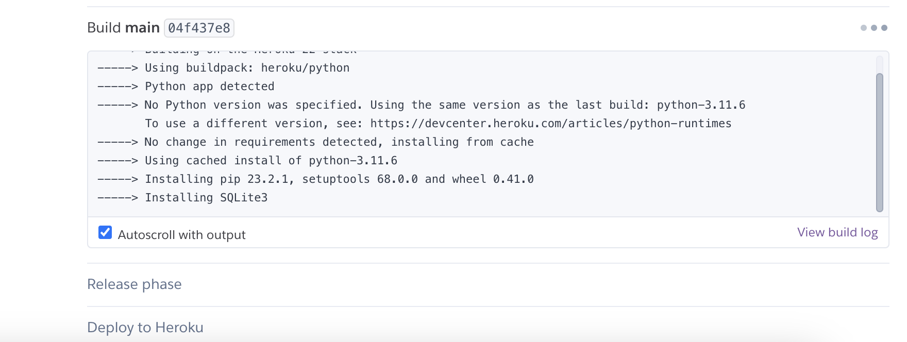
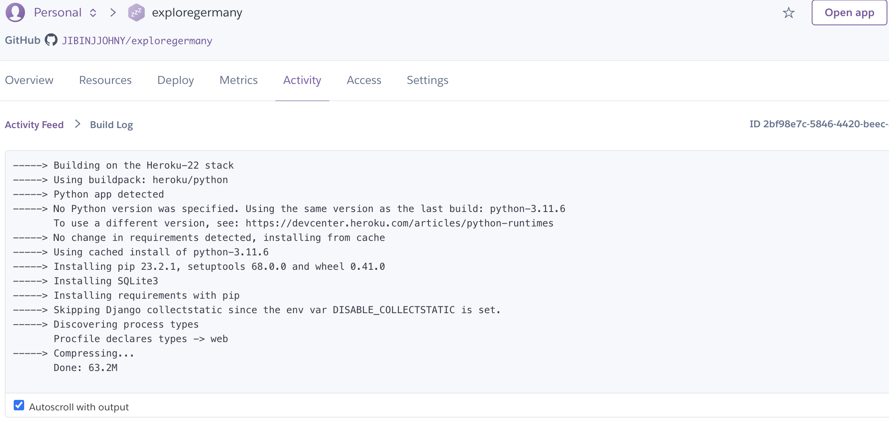

# Deployment

-The site was deployed to [Heroku](https://www.heroku.com). 

-The database is hosted on Heroku using PostgreSQL. Heroku provides a managed PostgreSQL database for this application.


- The site can be reached by the [link](https://exploregermany-c3b93e179fbb.herokuapp.com/).


*Note:* - All of the following must be installed for this project:
  . To initiate the terminal , type: - {pip3 install -r requirements.txt}.

One of the two procedures listed below can be used to make a local copy of the GitHub repository:

- Download ZIP file:
1. Go to the [GitHub Repo page](https://github.com/JIBINJJOHNY/exploregermany).
1. Download the project ZIP file by clicking the Code button.
1. On your PC, extract the ZIP file to a designated area.

Make a clone of the repository.
1. Use the terminal to open a folder on your computer.

1. Type`git clone https://github.com/JIBINJJOHNY/exploregermany.git` into the command window.

- As an alternative, you can use the Gitpod button below to make your own workspace with this repository.

  [](https://gitpod.io/new#https://github.com/jibinjjohny/exploregermany)

—-----

1. Set up the prerequisites:

    - Type `pip3 install -r requirements.txt` in the terminal window after it has opened.


1. To protect the privacy of your private data, create a `.gitignore` file in the project root directory and add the env.py and __pycache__ files to it.

1. Make a file called `.env`. The following environment variables will be included in this:

   ```python
    import os

      os.environ['SECRET_KEY'] = 'Add a secret key'
      os.environ['DATABASE_URL'] = 'will be used to connect to the database'
      os.environ['DEBUG'] = 'True'
    ```
    *DEBUG is initially set to True during the development stage, however it is imperative that this be changed to False.

    1. To perform migrations, type the following instructions into a terminal: 
    Make migrations with `python3 manage.py`
    The file `python3 manage.py migrate`
1. To gain access to the admin environment, create a superuser.
    The code `python3 manage.py createsuperuser`
    - Type in the necessary data (password, email address, and username).
1. Use the following command in the terminal to launch the application:
    Runserver: `python3 manage.py`
1. To view the app, open a browser and click the provided link.

1. Add /admin/ to the given link if you need to access the admin page.
    - Type in your password and username (for the superuser you previously created).
    . The admin page will be the next page you arrive at.

## Heroku Deployment

* Create a local Heroku workspace on your PC:
    - Compile a list of prerequisites for the project's operation.
      - Enter `pip3 freeze > requirements.txt` in the terminal - Commit and publish the modifications to GitHub
    
* Proceed to [www.heroku.com] (www.heroku.com) and either sign in or register for a Heroku account.
** Make a brand-new app called <name app>, or whatever makes sense.

   

* Establish a Procfile in your local workspace:

  
    
    The following will be included in this file:
    ```python
        web: gunicorn <name app>.wsgi:application 
     ```
    - commit and push the modifications to GitHub.

* Search for postgresql under Heroku's resources. To add Hobby dev - Free to the project, choose it and then click the provision button.


* Open the Heroku settings app and select Config Vars.
 

Add the following configuration variables by clicking on Reveal Config Vars:


| Key      | Value          |
|-------------|-------------|
| DATABASE_URL | ... | 
| DISABLE_COLLECTSTATIC | 1 |
| EMAIL_HOST_PASS | ... |
| EMAIL_HOST_USER | ... |
| HEROKU_HOSTNAME | ... |
| SECRET_KEY | ... |

* Copy the value of DATABASE_URL and input it into the .env file and generate a secret key (you may use [Djecrety](https://djecrety.ir/) for secret key generation).
* Create EMAIL_HOST_PASS and EMAIL_HOST_USER with a gmail account and add values to these keys.
* Migrate changes.
* Set debug to False in settings.py
* Commit and push the changes to GitHub.
* Connect your repository to Heroku.

 

* Click the "Deploy Branch" button to deploy the application to Heroku. Click "Enable Automatic Deployment" to activate auto-deployment.

   

The deployment process will start.
  

Click "View build logs" to see the progress of the deployment.

  

* Deploying your project from GitHub will not be possible due to security upgrades in the Heroku dashboard. The following commands must therefore be entered into your terminal:*

| action | terminal command | comment |
| ------ | ---------------- | ------- |
| login to your heroku account | `heroku login -i` | |
| create a new app on heroku | `heroku create NAME-OF-YOUR-APP` | if you haven't created the app before, and then, you can access the app via the Heroku dashboard and set up your config vars.|
| add remote to your local repository | `heroku git:remote -a NAME-OF-YOUR-APP` | if you have already created app on Heroku (before the security updates) and connected it using Heroku dashboard |
| deploy new version of the app | `git push heroku main` | |
| rename app | `git remote rename NAME-OF-YOUR-APP NAME-OF-YOUR-APP-2` | |

**Final Deployment**

* Set debug to False locally + delete DISABLE_COLLECTSTATIC from config vars in Heroku dashboard.
* Commit and push the changes to GitHub.
