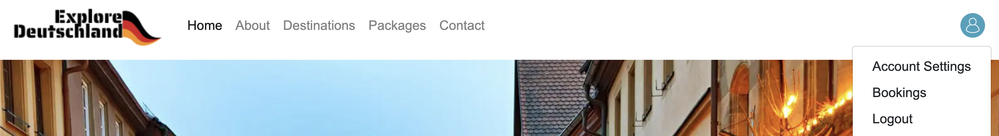

# Explore Deutschland

## Features

Website contains following pages:
- home page
- state detail page
- place detail page
- add review page
- view review page
- edit review page
- delete review page
- package detail page
- add booking page
- booking detail page
- booking list page
- booking edit page
- booking delete page
- accout setting page

- Each page has a navbar and a footer

**Navbar**

navbar contain following links.
- logo 
- home page
- about section
- destination section
- package section 
- about section 
- user image (if user logged in shows user avatar image otherwise shows signin link)
- if click the button shows dropdown menu contains 
    + account settings
    + bookings
    + logout

- account setting page  contains three buttons:
    +

- if user click logo it shows home page.
- home page contains:
    + about section
    + destination section
    + package section
    + contact us section

- 
