# Explore Deutschland

## Features

Website contains following pages:
- home page
- state detail page
- place detail page
- add review page
- view review page
- edit review page
- delete review page
- package detail page
- add booking page
- booking detail page
- booking list page
- booking edit page
- booking delete page
- accout setting page

- Each page has a navbar and a footer

**Navbar**

navbar contain following links.
- logo 
- home page
- about section
- destination section
- package section 
- about section 
- user image (if user logged in shows user avatar image otherwise shows signin link)
- if click the button shows dropdown menu contains 
    + account settings
    + bookings
    + logout
**account settings page**
- account setting page  contains three buttons:

    + Reset email (redirect to django email reset page )
    + Reset password(redirect to django password reset page)
    + Delete account(redirect to account delete page )
        * in this page delte account confirmation button if click delete account button account will delete permanently
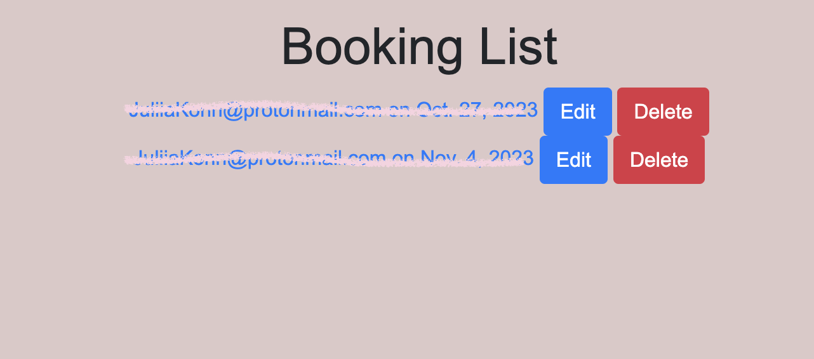
**bookings page**

- booking list page contains two buttons:
    **edit booking page**
    + edit booking (if click the button will redirect to edit bookins page)
        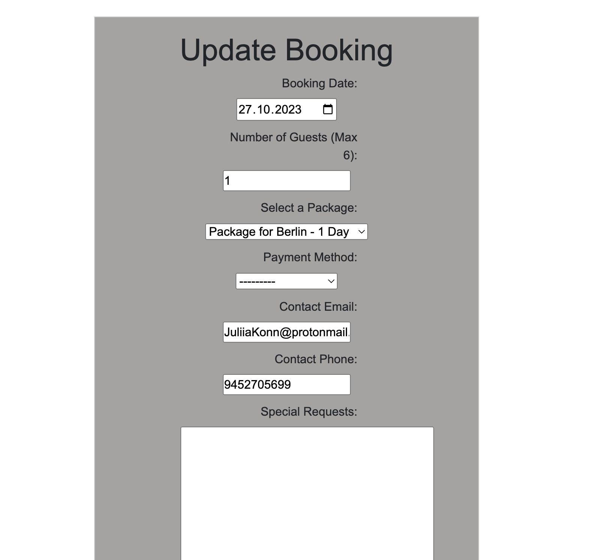
      **delete booking page**
    + delete booking (it will redirect to delte booking page )
        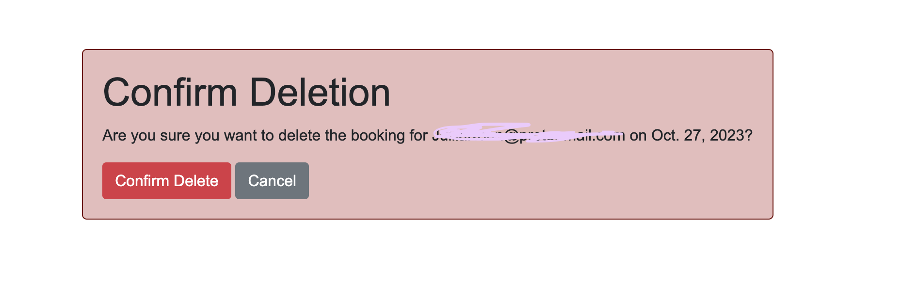

- if user click logo it shows home page.
- home page contains:
    + about section(Contains brief explanation of website )
    + destination section (includes a list of federal states explore germany offers tours )
        if click any of the state card it will redirect to state detail page.
     **state detail page**
       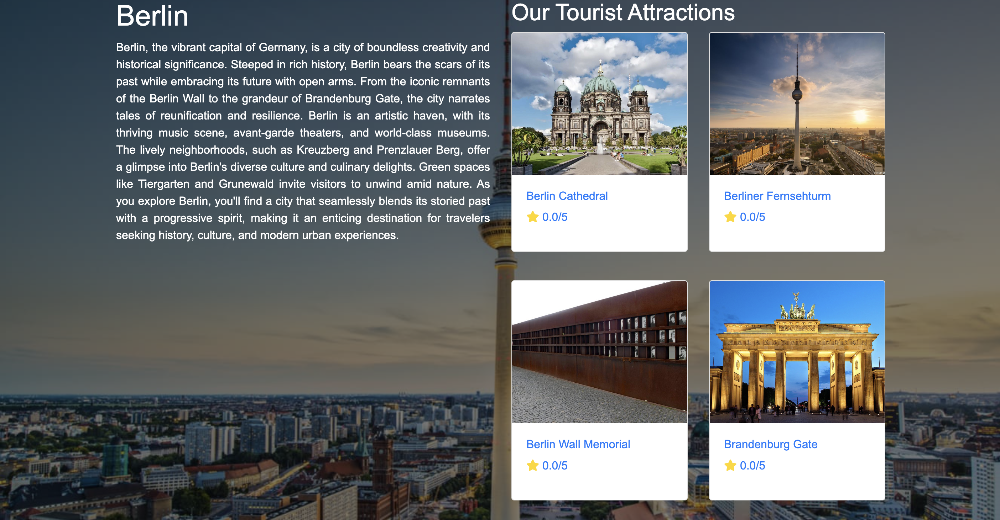 
        + in state detail page contain tourist attraction list and state description .
        + if user select any of the place card it will redirect to place detail page.
    **place detail page**
        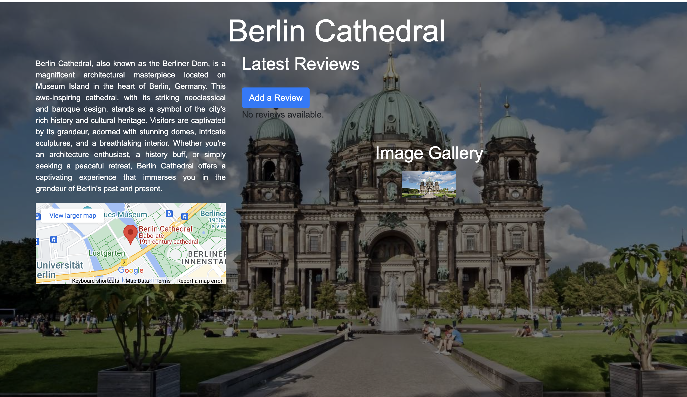 
        + in place detail page contains place discription ,latest 2 review with more review showing button.add review button, location map and image gallery.
        + if click add review button it will redirect to add review page.
        **add review page**
         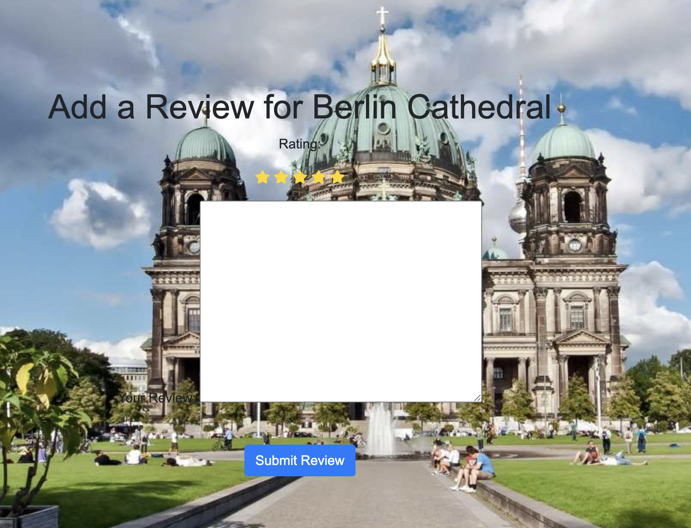 
        + in this page user can give star ratings and commemnts
        + click review submit button it will redirect to view revie page 
        **view review page**
          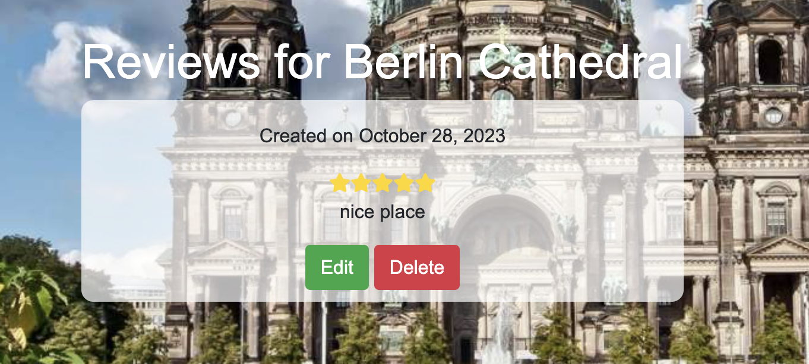 
        + in this page there is two buttons:
            1. edit button (click edit button redirect to edit review page)
        **edit review page**
          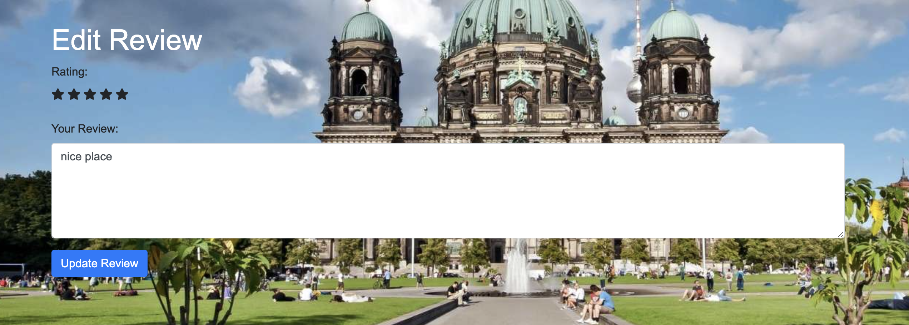 
          in this page user can update ratings and comments.
          then redirect to again view review page .
        
            2. delete button(it will redirect to confirm delete page)
        **delete review page**
            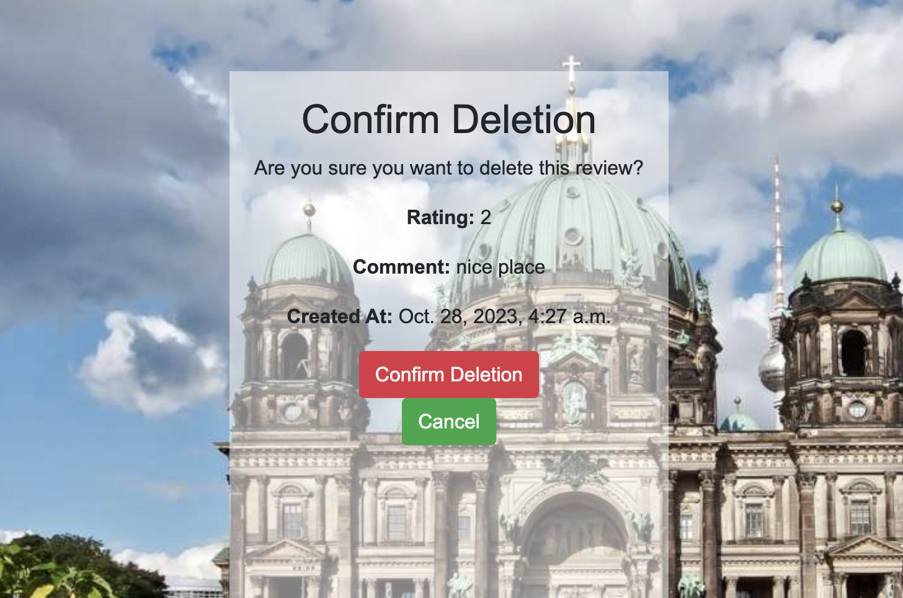 
            in this page user can confirm deltetion and also we can cancel from review deletion.
    
    + if click in image gallery it shows big image.

    **package detail page**
    + package section(contains list of federal states explore germany offers tours packages)

        1. contains state names button if click any of the button will redirect to package detail page it contains package days amount place details and also conatins travel discriptions and book button.

        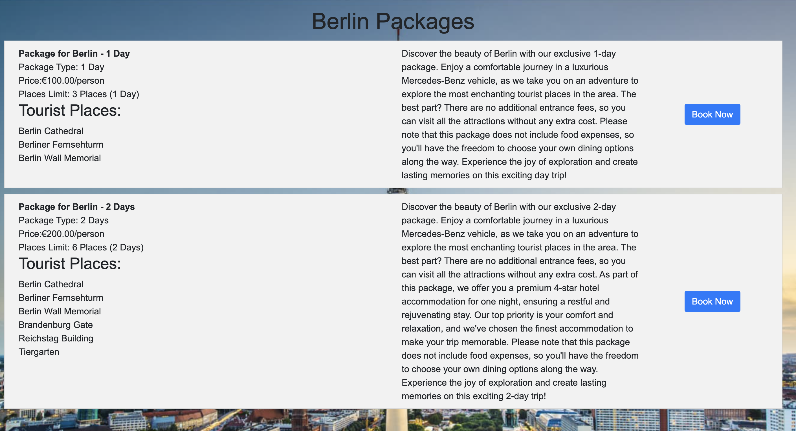 
        1. if user select any of the package button will redirect to booking form page.
    **booking form page**
         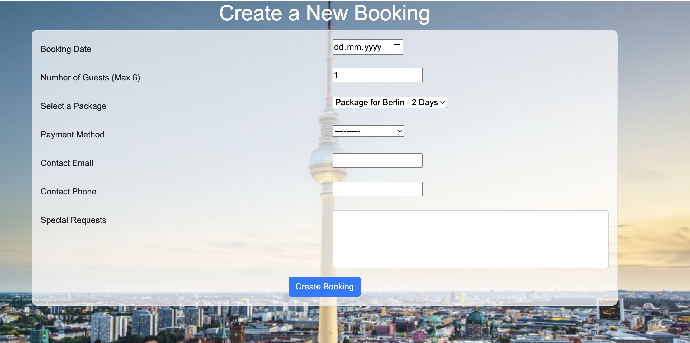 
            - in this page we can create our booking date only from current date and guest must max six persons if more than six it will show a alert message .if the user select previous date iw will also show message not possible.
            - booking section contain email field only email format only works.
            - if user gave correct information user can book if click the button will redirect to book detail page
    **booking detail page**
    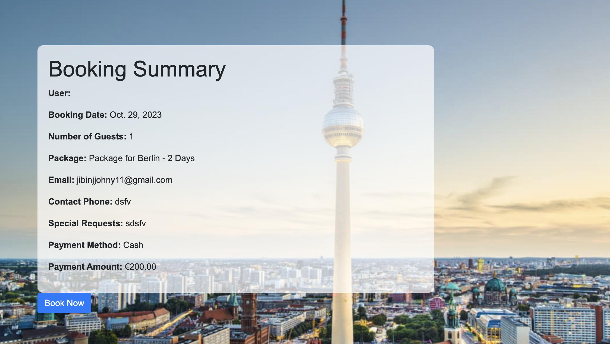 

        - in this page we can see one more time our booking details and also there is abuuton book if click this button there is a message come if you will get a confirmation email and user will get a confirmation email on given email id.

    + contact us section(provides company location map address phone and email)

 **Footer**

    - in footer section contains a small discription of website social media links to facebook,instagram,twitter,linkedin and git hub.
    - in middle section conatin address phone number and mail id 
    - last section contain logo and links to each section in home page same as nav bar.